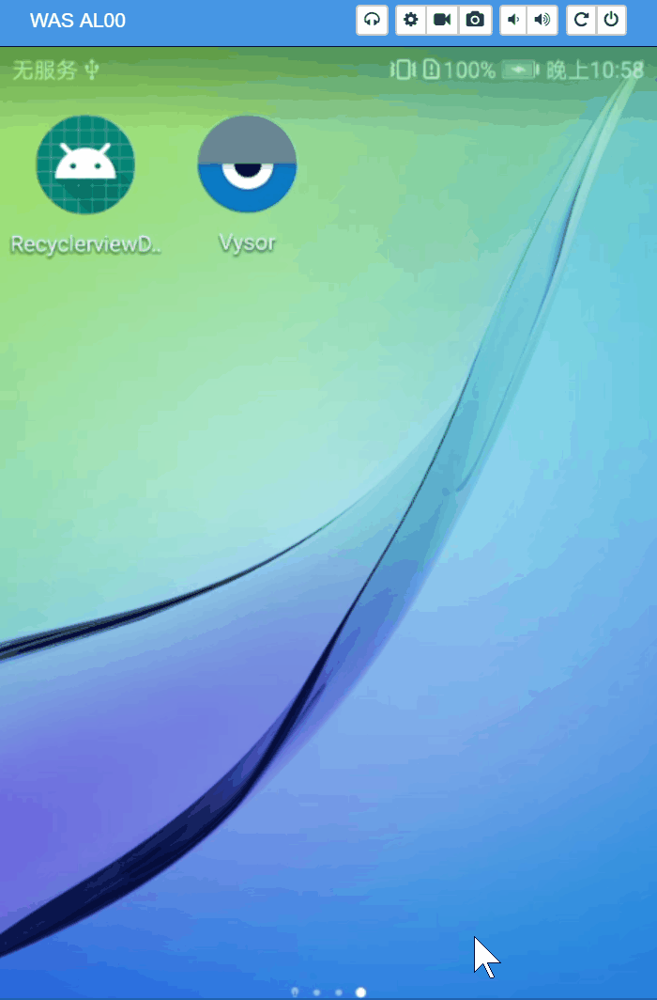
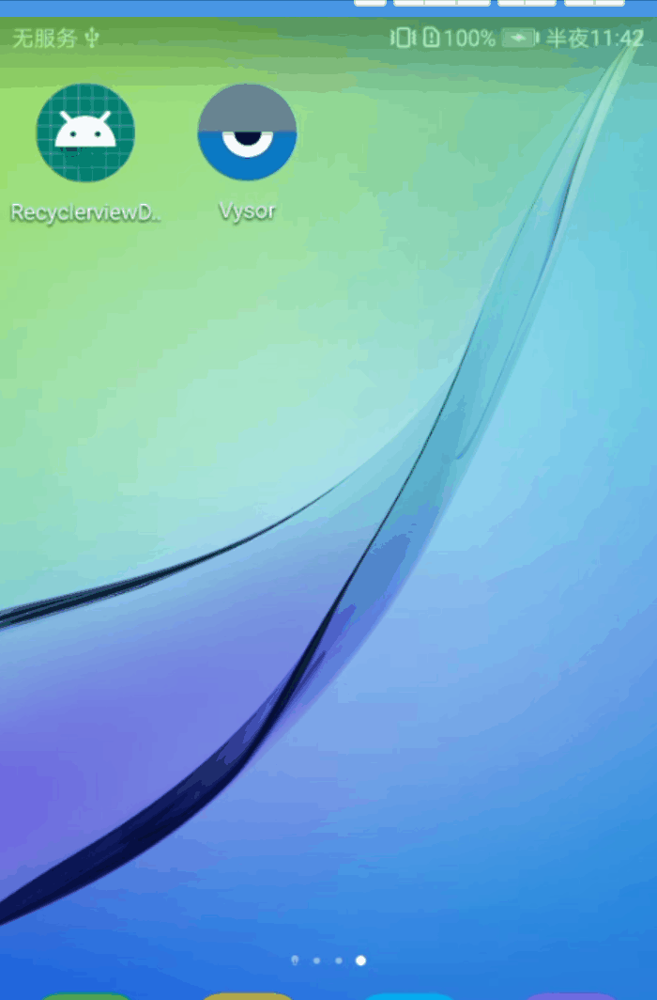
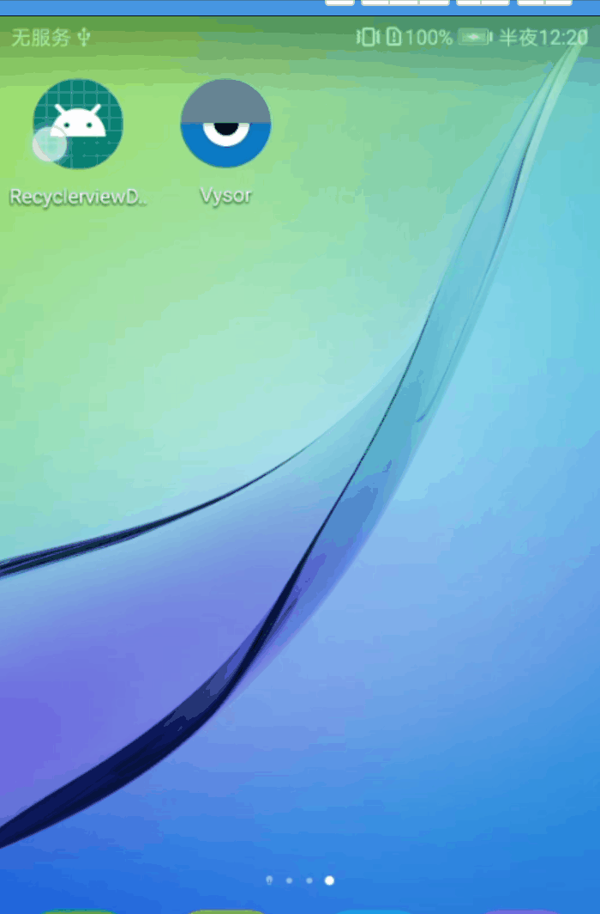

# RecyclerviewLayoutAnimationDemo
recyclerview 布局动画

# LayoutAnimation 布局动画

## 实现

### 方式一：通过代码动态设置

1. `AnimationUtils.loadAnimation` 产生一个`Animation` 对象
2. 创建`LayoutAnimationController`对象 , 传入 `Animation`
3. 通过`setLayoutAnimation()` 配置`LayoutAnimation`

```kotlin
val animation = AnimationUtils.loadAnimation(this, R.anim.rlv_b_t)
val layoutAnimationController = LayoutAnimationController(animation)
layoutAnimationController.delay = 0.3f
layoutAnimationController.order = LayoutAnimationController.ORDER_NORMAL
rlv.layoutAnimation = layoutAnimationController
```

anim/rlv_b_t.xml

```xml
<?xml version="1.0" encoding="utf-8"?>
<set xmlns:android="http://schemas.android.com/apk/res/android">
    <translate
        android:duration="600"
        android:fromYDelta="100%p"
        android:toYDelta="0" />
</set>
```

其中`LayoutAnimationController`的`getTransformedIndex`方法,通过重写可以控制view动画执行的顺序

```kotlin
val layoutAnimationController = object :LayoutAnimationController(animation){
            override fun getTransformedIndex(params: AnimationParameters?): Int {
                return if (params!!.index >= 3) 1 else 0
                //其中params.index 表示子控件在父控件中的位置，返回的参数表示动画执行顺序，值越小越先执行
                //return 数字越小代表先执行
                //return if (params!!.index >= 3) 1 else 0 表示 如果当前view的索引大于3 即第四个view 就后执行动画（return 1），前面的先执行（return 0）
            }
        }
```



**同样也可以自由定制动画效果**



1.自定义`LayoutAnimationController`

```java
/**
 * 作者 : zyy（赵岩）
 * 时间 : 2019/3/28
 */
public class CustomLayoutAnimationController extends LayoutAnimationController {

    private Callback onIndexListener;

    public void setOnIndexListener(Callback onIndexListener) {
        this.onIndexListener = onIndexListener;
    }

    public CustomLayoutAnimationController(Animation anim) {
        super(anim);
    }

    @Override
    protected int getTransformedIndex(AnimationParameters params) {
        if (onIndexListener != null) {
            return onIndexListener.onIndex(this, params.count, params.index);
        } else {
            return super.getTransformedIndex(params);
        }
    }

    public interface Callback {
        int onIndex(CustomLayoutAnimationController controller, int count, int index);
    }
}

```

2.`MainActivity`中实现`Callback`通过对这个方法返回值的控制就可以完成动画的顺序

```kotlin
class MainActivity() : AppCompatActivity(), CustomLayoutAnimationController.Callback {

    override fun onIndex(controller: CustomLayoutAnimationController?, count: Int, index: Int): Int {
        return when (index) {
            //顺序控制的关键部分 具体实现就是根据子view的索引位置控制return的大小完成的
            0 -> 0
            1, 3 -> 1
            2, 4, 6 -> 3
            5, 7, 9 -> 4
            8, 10 -> 5
            11 -> 6
            else -> 0
        }
    }

    override fun onCreate(savedInstanceState: Bundle?) {
        super.onCreate(savedInstanceState)
        setContentView(R.layout.activity_main)
        rlv.layoutManager = GridLayoutManager(this, 3)

        val animation = AnimationUtils.loadAnimation(this, R.anim.rlv_scal)
        /*  val layoutAnimationController = object :LayoutAnimationController(animation){
              override fun getTransformedIndex(params: AnimationParameters?): Int {
                  Log.e("params","${params!!.index} ")
                  return if (params!!.index >= 3) 1 else 0
                  //其中params.index 表示子控件在父控件中的位置，返回的参数表示动画执行顺序，值越小越先执行
                  //返回数值小代表先执行
                  //return if (params!!.index >= 3) 1 else 0 表示 如果当前view的索引大于3 即第四个view 就后执行动画（return 1），前面的先执行（return 0）
              }
          }*/
        val layoutAnimationController = CustomLayoutAnimationController(animation)
        layoutAnimationController.setOnIndexListener(this);
        layoutAnimationController.delay = 0.3f
        layoutAnimationController.order = LayoutAnimationController.ORDER_NORMAL
        rlv.layoutAnimation = layoutAnimationController
        rlv.adapter = RlvAdapter(this)

    }
}
```

ps：如果在数据刷新时重新载入动画`scheduleLayoutAnimation`

```kotlin
rlv?.adapter?.notifyDataSetChanged()
rlv.scheduleLayoutAnimation()
```


### 方式二：Xml引入

`anim/item_animation_fall_down.xml`

```xml
<set xmlns:android="http://schemas.android.com/apk/res/android"
     android:duration="@integer/anim_duration_medium">
    <translate
        android:fromYDelta="-20%"
        android:toYDelta="0"
        android:interpolator="@android:anim/decelerate_interpolator"/>
    <alpha
        android:fromAlpha="0"
        android:toAlpha="1"
        android:interpolator="@android:anim/decelerate_interpolator"/>
    <scale
        android:fromXScale="105%"
        android:fromYScale="105%"
        android:toXScale="100%"
        android:toYScale="100%"
        android:pivotX="50%"
        android:pivotY="50%"
        android:interpolator="@android:anim/decelerate_interpolator"/>
</set>
```

`anim/layout_animation_fall_down.xml`

```xml
<?xml version="1.0" encoding="utf-8"?>
<layoutAnimation
    xmlns:android="http://schemas.android.com/apk/res/android"
    android:animation="@anim/item_animation_fall_down"
    android:delay="15%"
    android:animationOrder="normal"/>
```

`layout/main_activity.xml`

```xml
<android.support.v7.widget.RecyclerView
    android:layout_width="match_parent"
    android:layout_height="match_parent"                                        
    android:layoutAnimation="@anim/layout_animation_fall_down"
    />
```



> ps:有关列表两端阴影效果的设置  [参考](https://blog.csdn.net/u012702547/article/details/52913538)

```xml
<android.support.v7.widget.RecyclerView 
	android:fadingEdge="vertical"
    android:fadingEdgeLength="50dp"
    android:requiresFadingEdge="vertical"/>
```

`fadingEdgeLength`表示 阴影的长度

`fadingEdge`表示 阴影的方向`none`（边框颜色不变），`horizontal`（水平方向颜色变淡），`vertical`（垂直方向颜色变淡）。 

`requiresFadingEdge`滚动时边缘是否褪色

> TextView可滚动

```java
tv.setMovementMethod(new ScrollingMovementMethod());
```

